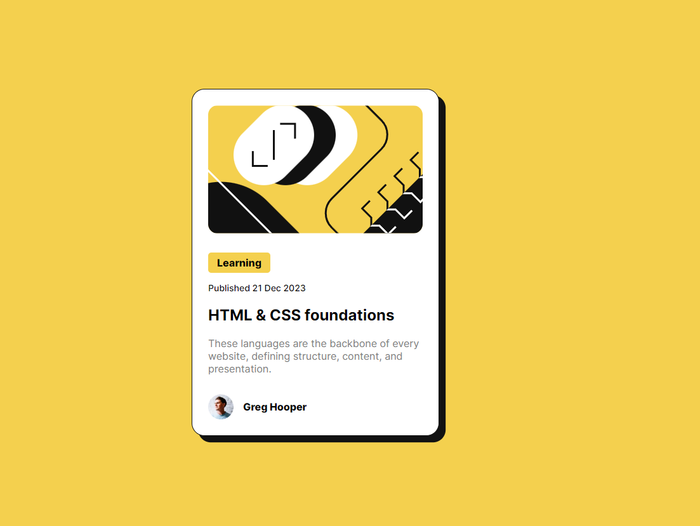

# Blog Preview card
---

## Project Description
I made this project in order to improve my HTML and CSS.
I used the site [Frontend Mentor](https://www.frontendmentor.io/challenges/recipe-page-KiTsR8QQKm) and choose the challenge "Blog Preview card".

I had to replicate the layout of the original.

This is a simple page that shows a card that has an article, in this case abour html and css, with a relevant keyword.
I added a small animation in the box shadow when the user hover card with the mouse.

I feel very proud of my achievement, my replica is super similar to the original and it responds well to small devices.

I think i still have issues in organizing may css, but this one was very easy organize, due to the fact that i didn't had a lot of elements to change.

---
## Technologies used

I used HTML and CSS to finish this challenge.

---
## Preview

